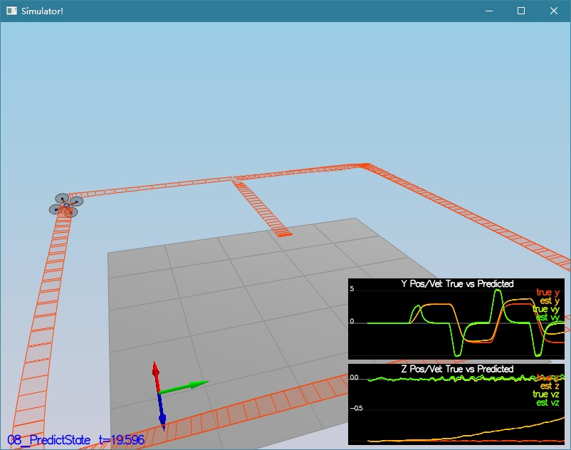

# Project: 3D Quad Estimator

---


# [Rubric](https://review.udacity.com/#!/rubrics/1807/view) Points
Here I will consider the rubric points individually and describe how I addressed each point in my implementation.

---
## Writeup / README

### 1. Provide a Writeup / README that includes all the rubric points and how you addressed each one.  You can submit your writeup as markdown or pdf.

You're reading it! Below I describe how I addressed each rubric point and where in my code each point is handled.

## Implement Estimator

### 1. Determine the standard deviation of the measurement noise of both GPS X data and Accelerometer X data.
After running this scenario `06_SensorNoise`, I obtained two text files `config/log/Graph1.txt` and `config/log/Graph2.txt` containing the received data for each timestep.

Finally, I implemented a simple Python script that parses this CSV file and computed
the standard deviation of the received measurements (assuming mean = 0.0). The script is shown below:

```python
import numpy as np

paths = ['config/log/Graph1.txt', 'config/log/Graph2.txt']

for path in paths:
    data = np.loadtxt(path, delimiter=',', skiprows=1)
    std = np.std(data[:,1])
    print('Standard Deviation for data in {}: {}'.format(path, std))
```

And this provides the following result:

```
Standard Deviation for data in config/log/Graph1.txt: 0.7132509190145858
Standard Deviation for data in config/log/Graph2.txt: 0.4975951294213284
```

Standard deviation of the GPS is very close to 0.713.
Standard deviation of the accelerometer is very close to 0.497.

after I changed the configurations MeasuredStdDev_GPSPosXY and MeasuredStdDev_AccelXY in `config/06_SensorNoise.txt`, the scenario `06_SensorNoise` passed successfully:


```
Simulation #7 (../config/06_SensorNoise.txt)
PASS: ABS(Quad.GPS.X-Quad.Pos.X) was less than MeasuredStdDev_GPSPosXY for 71% of the time
PASS: ABS(Quad.IMU.AX-0.000000) was less than MeasuredStdDev_AccelXY for 68% of the time
```


### 2. Implement a better rate gyro attitude integration scheme in the `UpdateFromIMU()` function.

I implemented a non-linear gyro attitude integration based on quaternions, which is explained in section `7.1.2 Non-linear complementary filter` of the document [Estimation for Quadrotors](https://www.overleaf.com/read/vymfngphcccj#/54894644/).

The implementation in the `QuadEstimatorEKF::UpdateFromIMU` function:

```cpp
void QuadEstimatorEKF::UpdateFromIMU(V3F accel, V3F gyro)
{
  // Improve a complementary filter-type attitude filter
  //
  // Currently a small-angle approximation integration method is implemented
  // The integrated (predicted) value is then updated in a complementary filter style with attitude information from accelerometers
  //
  // Implement a better integration method that uses the current attitude estimate (rollEst, pitchEst and ekfState(6))
  // to integrate the body rates into new Euler angles.
  //
  // HINTS:
  //  - there are several ways to go about this, including:
  //    1) create a rotation matrix based on your current Euler angles, integrate that, convert back to Euler angles
  //    OR
  //    2) use the Quaternion<float> class, which has a handy FromEuler123_RPY function for creating a quaternion from Euler Roll/PitchYaw
  //       (Quaternion<float> also has a IntegrateBodyRate function, though this uses quaternions, not Euler angles)

  ////////////////////////////// BEGIN STUDENT CODE ///////////////////////////
  // SMALL ANGLE GYRO INTEGRATION:
  // (replace the code below)
  // make sure you comment it out when you add your own code -- otherwise e.g. you might integrate yaw twice

	// COMMENT OUT
//  float predictedPitch = pitchEst + dtIMU * gyro.y;
//  float predictedRoll = rollEst + dtIMU * gyro.x;
//  ekfState(6) = ekfState(6) + dtIMU * gyro.z;	// yaw

	// ADD
	Quaternion<float> q = Quaternion<float>::FromEuler123_RPY(rollEst, pitchEst, ekfState(6));
	q.IntegrateBodyRate(gyro, dtIMU);
	float predictedRoll = q.Roll();
	float predictedPitch = q.Pitch();
	ekfState(6) = q.Yaw();

  // normalize yaw to -pi .. pi
  if (ekfState(6) > F_PI) ekfState(6) -= 2.f*F_PI;
  if (ekfState(6) < -F_PI) ekfState(6) += 2.f*F_PI;

  /////////////////////////////// END STUDENT CODE ////////////////////////////

  // CALCULATE UPDATE
  accelRoll = atan2f(accel.y, accel.z);
  accelPitch = atan2f(-accel.x, 9.81f);

  // FUSE INTEGRATION AND UPDATE
  rollEst = attitudeTau / (attitudeTau + dtIMU) * (predictedRoll)+dtIMU / (attitudeTau + dtIMU) * accelRoll;
  pitchEst = attitudeTau / (attitudeTau + dtIMU) * (predictedPitch)+dtIMU / (attitudeTau + dtIMU) * accelPitch;

  lastGyro = gyro;
}
```

This gives much better results than the linear complementary filter, managing to pass
scenario `07_AttitudeEstimation`:


```
Simulation #44 (../config/07_AttitudeEstimation.txt)
PASS: ABS(Quad.Est.E.MaxEuler) was less than 0.100000 for at least 3.000000 seconds
```

### 3. Implement all of the elements of the prediction step for the estimator.

#### State update

I implemented the `QuadEstimatorEKF::PredictState` function using Equation (49) in section
`7.2 Transition Model` of the document [Estimation for Quadrotors](https://www.overleaf.com/read/vymfngphcccj#/54894644/).
The implementation in the `QuadEstimatorEKF::PredictState` function:

```cpp
VectorXf QuadEstimatorEKF::PredictState(VectorXf curState, float dt, V3F accel, V3F gyro)
{
  assert(curState.size() == QUAD_EKF_NUM_STATES);
  VectorXf predictedState = curState;
  // Predict the current state forward by time dt using current accelerations and body rates as input
  // INPUTS:
  //   curState: starting state
  //   dt: time step to predict forward by [s]
  //   accel: acceleration of the vehicle, in body frame, *not including gravity* [m/s2]
  //   gyro: body rates of the vehicle, in body frame [rad/s]
  //   
  // OUTPUT:
  //   return the predicted state as a vector

  // HINTS
  // - dt is the time duration for which you should predict. It will be very short (on the order of 1ms)
  //   so simplistic integration methods are fine here
  // - we've created an Attitude Quaternion for you from the current state. Use
  //   attitude.Rotate_BtoI(<V3F>) to rotate a vector from body frame to inertial frame
  // - the yaw integral is already done in the IMU update. Be sure not to integrate it again here

  Quaternion<float> attitude = Quaternion<float>::FromEuler123_RPY(rollEst, pitchEst, curState(6));

  ////////////////////////////// BEGIN STUDENT CODE ///////////////////////////

  // ADD

  // Integrate position
  predictedState(0) += curState(3)*dt;
  predictedState(1) += curState(4)*dt;
  predictedState(2) += curState(5)*dt;

  // Integrate velocities
  const V3F accel_inertial = attitude.Rotate_BtoI(accel) - V3F(0.0F, 0.0F, static_cast<float>(CONST_GRAVITY));

  predictedState(3) += accel_inertial[0] * dt;
  predictedState(4) += accel_inertial[1] * dt;
  predictedState(5) += accel_inertial[2] * dt;

  // The yaw integral is already done in the IMU update
  predictedState(6) = curState(6);

  /////////////////////////////// END STUDENT CODE ////////////////////////////

  return predictedState;
}

```

The input `u_t`, which in this case is the acceleration, is rotated from body to world
frame using the matrix `R_bg`. This is easily implemented with the function `Rotate_BtoI`.
Finally, we do not integrate the yaw since that was already done in the IMU update.
The drone can now accurately follow the trajectory:



#### Covariance update

I computed the matrix `gPrime` (Equation 51). First, we implement the matrix `Rbg_prime` in the function `QuadEstimatorEKF::GetRbgPrime`:

```cpp
MatrixXf QuadEstimatorEKF::GetRbgPrime(float roll, float pitch, float yaw)
{
  // first, figure out the Rbg_prime
  MatrixXf RbgPrime(3, 3);
  RbgPrime.setZero();

  // Return the partial derivative of the Rbg rotation matrix with respect to yaw. We call this RbgPrime.
  // INPUTS:
  //   roll, pitch, yaw: Euler angles at which to calculate RbgPrime
  //   
  // OUTPUT:
  //   return the 3x3 matrix representing the partial derivative at the given point

  // HINTS
  // - this is just a matter of putting the right sin() and cos() functions in the right place.
  //   make sure you write clear code and triple-check your math
  // - You can also do some numerical partial derivatives in a unit test scheme to check
  //   that your calculations are reasonable

  ////////////////////////////// BEGIN STUDENT CODE ///////////////////////////
  // Match notation
  const float phi = roll;
  const float theta = pitch;
  const float psi = yaw;

  // Cosines and sines
  const float cos_phi = std::cos(phi);
  const float sin_phi = std::sin(phi);

  const float cos_theta = std::cos(theta);
  const float sin_theta = std::sin(theta);

  const float cos_psi = std::cos(psi);
  const float sin_psi = std::sin(psi);

  // Fill the matrix
  RbgPrime(0,0) = -cos_theta*sin_psi;
  RbgPrime(0,1) = -sin_phi*sin_theta*sin_psi - cos_theta*cos_psi;
  RbgPrime(0,2) = -cos_phi*sin_theta*sin_psi + sin_phi*cos_psi;
  RbgPrime(1,0) = cos_theta*cos_psi;
  RbgPrime(1,1) = sin_phi*sin_theta*cos_psi - cos_phi*sin_psi;
  RbgPrime(1,2) = cos_phi*sin_theta*cos_psi + sin_phi*sin_psi;
  RbgPrime(2,0) = 0.0F;
  RbgPrime(2,1) = 0.0F;
  RbgPrime(2,2) = 0.0F;

  /////////////////////////////// END STUDENT CODE ////////////////////////////

  return RbgPrime;
}
```

I implemented the matrix `gPrime`, and I computed the new covariance matrix following the EKF covariance update equation (see Algorithm 2 in the document [Estimation for Quadrotors](https://www.overleaf.com/read/vymfngphcccj#/54894644/)).
These were writen in the `QuadEstimatorEKF::Predict` function:

```cpp
void QuadEstimatorEKF::Predict(float dt, V3F accel, V3F gyro)
{
  // predict the state forward
  VectorXf newState = PredictState(ekfState, dt, accel, gyro);

  // Predict the current covariance forward by dt using the current accelerations and body rates as input.
  // INPUTS:
  //   dt: time step to predict forward by [s]
  //   accel: acceleration of the vehicle, in body frame, *not including gravity* [m/s2]
  //   gyro: body rates of the vehicle, in body frame [rad/s]
  //   state (member variable): current state (state at the beginning of this prediction)
  //   
  // OUTPUT:
  //   update the member variable cov to the predicted covariance

  // HINTS
  // - update the covariance matrix cov according to the EKF equation.
  //
  // - you may find the current estimated attitude in variables rollEst, pitchEst, state(6).
  //
  // - use the class MatrixXf for matrices. To create a 3x5 matrix A, use MatrixXf A(3,5).
  //
  // - the transition model covariance, Q, is loaded up from a parameter file in member variable Q
  //
  // - This is unfortunately a messy step. Try to split this up into clear, manageable steps:
  //   1) Calculate the necessary helper matrices, building up the transition jacobian
  //   2) Once all the matrices are there, write the equation to update cov.
  //
  // - if you want to transpose a matrix in-place, use A.transposeInPlace(), not A = A.transpose()
  //

  // we'll want the partial derivative of the Rbg matrix
  MatrixXf RbgPrime = GetRbgPrime(rollEst, pitchEst, ekfState(6));

  // we've created an empty Jacobian for you, currently simply set to identity
  MatrixXf gPrime(QUAD_EKF_NUM_STATES, QUAD_EKF_NUM_STATES);
  gPrime.setIdentity();

  ////////////////////////////// BEGIN STUDENT CODE ///////////////////////////

  // Create acceleration vector as a VectorXf
  VectorXf accel_eigen(3);
  accel_eigen(0) = accel[0];
  accel_eigen(1) = accel[1];
  accel_eigen(2) = accel[2];

  // Multiply times RbgPrime
  const VectorXf RbgPrimeTimeAccel = RbgPrime * accel_eigen;

  // Compute g prime
  gPrime(0, 3) = dt;
  gPrime(1, 4) = dt;
  gPrime(2, 5) = dt;
  gPrime(3, 6) = RbgPrimeTimeAccel(0)*dt;
  gPrime(4, 6) = RbgPrimeTimeAccel(1)*dt;
  gPrime(5, 6) = RbgPrimeTimeAccel(2)*dt;

  // Covariance matrix
  MatrixXf newCov = gPrime * ekfCov * gPrime.transpose() + Q;
  ekfCov = newCov;

  /////////////////////////////// END STUDENT CODE ////////////////////////////

  ekfState = newState;
}
```

I ran the scenario `09_PredictCovariance` to validate this. I tuned the corresponding process noise to capture the uncertainty accurately.


### 4. Implement the magnetometer update.

I implemented the magnetometer update in the function `QuadEstimatorEKF::UpdateFromMag`, using the equations shown in section 7.3.2 of the document [Estimation for Quadrotors](https://www.overleaf.com/read/vymfngphcccj#/54894644/)):

```cpp
void QuadEstimatorEKF::UpdateFromMag(float magYaw)
{
  VectorXf z(1), zFromX(1);
  z(0) = magYaw;

  MatrixXf hPrime(1, QUAD_EKF_NUM_STATES);
  hPrime.setZero();

  // MAGNETOMETER UPDATE
  // Hints:
  //  - Your current estimated yaw can be found in the state vector: ekfState(6)
  //  - Make sure to normalize the difference between your measured and estimated yaw
  //    (you don't want to update your yaw the long way around the circle)
  //  - The magnetomer measurement covariance is available in member variable R_Mag
  ////////////////////////////// BEGIN STUDENT CODE ///////////////////////////
  hPrime(6) = 1.0F;
  zFromX(0) = ekfState(6);

  float x = z(0) - zFromX(0);
  float y = fmodf(x + F_PI, 2.0F * F_PI);
  if (y < 0.0F)
  {
	  y += 2.0F * F_PI;
  }
  const float shortest_difference = y - F_PI;
  zFromX(0) = z(0) - shortest_difference;
  /////////////////////////////// END STUDENT CODE ////////////////////////////

  Update(z, hPrime, R_Mag, zFromX);
}

```

I verified the implementation running scenario `10_MagUpdate`:


```
Simulation #4 (../config/10_MagUpdate.txt)
PASS: ABS(Quad.Est.E.Yaw) was less than 0.120000 for at least 10.000000 seconds
PASS: ABS(Quad.Est.E.Yaw-0.000000) was less than Quad.Est.S.Yaw for 78% of the time
```

### 5. Implement the GPS update.

I implemented the GPS update in the function `QuadEstimatorEKF::UpdateFromGPS`, following
section 7.3.1 of the document [Estimation for Quadrotors](https://www.overleaf.com/read/vymfngphcccj#/54894644/)):

```cpp
void QuadEstimatorEKF::UpdateFromGPS(V3F pos, V3F vel)
{
  VectorXf z(6), zFromX(6);
  z(0) = pos.x;
  z(1) = pos.y;
  z(2) = pos.z;
  z(3) = vel.x;
  z(4) = vel.y;
  z(5) = vel.z;

  MatrixXf hPrime(6, QUAD_EKF_NUM_STATES);
  hPrime.setZero();

  // GPS UPDATE
  // Hints:
  //  - The GPS measurement covariance is available in member variable R_GPS
  //  - this is a very simple update
  ////////////////////////////// BEGIN STUDENT CODE ///////////////////////////
  for (std::size_t i = 0; i < 6; ++i)
  {
	  zFromX(i) = ekfState(i);
	  hPrime(i, i) = 1.0F;
  }
  /////////////////////////////// END STUDENT CODE ////////////////////////////

  Update(z, hPrime, R_GPS, zFromX);
}
```

Starting from zero-initialized matrices `zFromX` and `hPrime`, I set the measured value to the estimated value, and filled the diagonal of the `hPrime` matrix (first 6 elements) with ones.

## Flight Evaluation

### 1. Meet the performance criteria of each step.
All scenarios meet the performance criteria, as shown in the previous sections.


### 2. De-tune your controller to successfully fly the final desired box trajectory with your estimator and realistic sensors.
I de-tuned the controller by reducing the position and velocity gains. This made the drone fly with an error of <1m for the entire box flight, as show in the image and command line output below:


```
Simulation #18 (../config/11_GPSUpdate.txt)
PASS: ABS(Quad.Est.E.Pos) was less than 1.000000 for at least 20.000000 seconds
Simulation #19 (../config/11_GPSUpdate.txt)
PASS: ABS(Quad.Est.E.Pos) was less than 1.000000 for at least 20.000000 seconds
```
